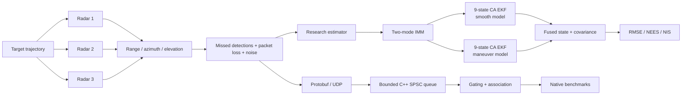
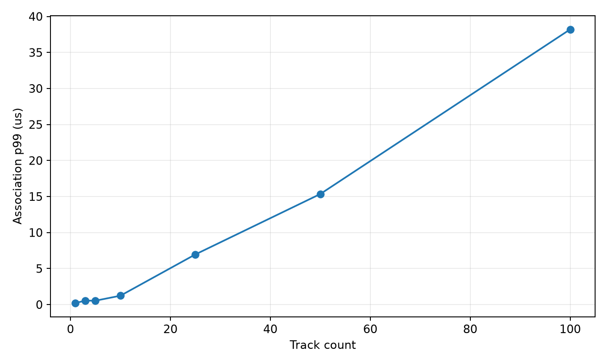
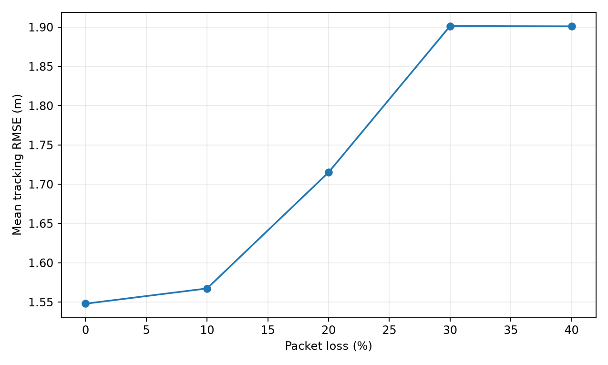
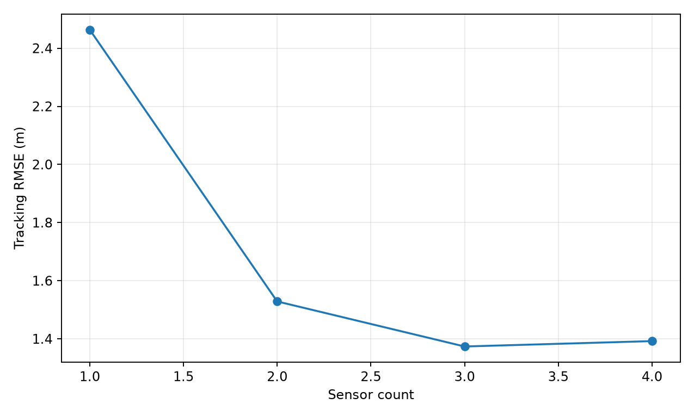
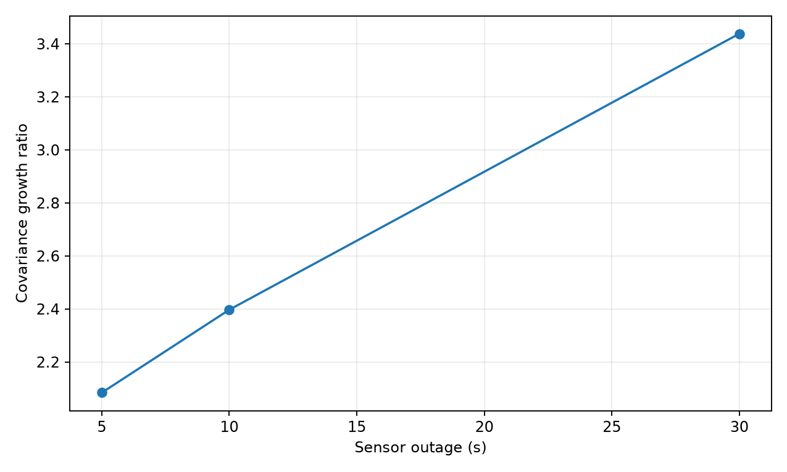
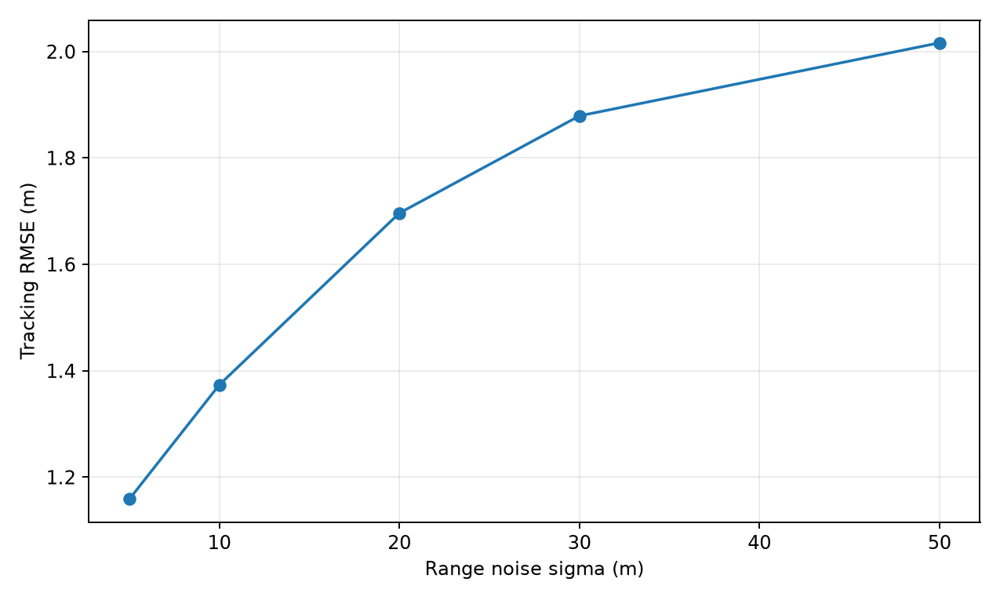

# Aurora Borealis

**Multi-sensor tracking and state-estimation under unreliable sensing.**

[](https://github.com/cybr-wisp/aurora-borealis/actions/workflows/test.yaml)
[](https://github.com/cybr-wisp/aurora-borealis/actions/workflows/benchmark.yaml)

<p align="left">
  
  
  
  
  
  
</p>

<p align="left">
  
  
  
</p>

**Multi-sensor tracking and state-estimation under unreliable sensing.**

Aurora Borealis is a research-oriented tracking system for studying how
multi-radar estimators behave under missed detections, packet loss, sensor
noise, and target maneuvers.

The project combines deterministic radar simulation, nonlinear Bayesian
filtering, interacting multiple-model estimation, statistical consistency
testing, and a native C++ ingestion / association pipeline.

---

## Results

The final estimator was frozen before evaluation on **50 previously unseen
Monte Carlo seeds per trajectory regime**.

Every run used:

- 3 independent radars
- 30% missed detections per radar
- 10% packet loss per radar
- noisy range / azimuth / elevation measurements

| Held-out metric | Coordinated turn | Abrupt maneuver |
|---|---:|---:|
| Runs | 50 | 50 |
| Mean RMSE | **4.411 m** | **4.490 m** |
| p95 RMSE | **4.658 m** | **4.839 m** |
| Maximum RMSE | 5.045 m | 5.184 m |
| Runs below 5 m | **98%** | **98%** |
| Empirical 6D NEES coverage | **93.76%** | **91.25%** |
| Mean 6D NEES | 5.233 | **5.946** |
| Mean 3D NIS | **2.946** | **2.959** |

**98 of 100 held-out scenario-runs remained below 5 m RMSE.**

The nominal expectations are `E[NEES] = 6` for the six-state consistency
test and `E[NIS] = 3` for the radar innovation. The abrupt-maneuver mean
NEES of **5.946** and mean NIS of **2.959** are close to their nominal
expectations, although empirical NEES interval coverage under maneuver
remains below the nominal 95% target.

The repository preserves that failure rather than tuning against the final
seeds.

---

## System

Aurora has two complementary evaluation paths.



### Research estimation path

The final estimator uses two constant-acceleration EKFs with state

```text
[x, y, z, vx, vy, vz, ax, ay, az]
```

inside an interacting multiple-model estimator.

Frozen final configuration:

```text
smooth-model jerk Q       = 0.1
maneuver-model jerk Q     = 100.0

P(smooth -> maneuver)     = 0.01
P(maneuver -> smooth)     = 0.10

initial mode probability  = [0.98, 0.02]
initial acceleration var  = 100

within-model covariance scale = 0.75
between-model uncertainty     = preserved
```

Mode probabilities are updated from radar measurement likelihoods, while
IMM mixing carries both within-model covariance and disagreement between
models into the fused posterior.

### Native systems path

The C++ side implements the performance-sensitive sensor path:

```text
UDP
 ↓
Protobuf decode
 ↓
validation
 ↓
bounded SPSC ingestion queue
 ↓
gating / data association
 ↓
tracking
```

UDP is intentional: sensor telemetry is freshness-sensitive, so occasional
loss is preferable to transport-level head-of-line blocking.

---

## Why this is non-trivial

### Deterministic stochastic simulation

Each radar owns an independent pseudo-random stream derived from

```text
(scenario seed, sensor id)
```

so adding or removing one sensor does not perturb another sensor's noise
sequence.

This makes estimator comparisons reproducible: two filters evaluated on the
same seed see the same missed detections, packet loss, and measurement noise.

### Native nonlinear measurements

Radar observations remain in:

```text
range
azimuth
elevation
```

until the estimator update.

They are not prematurely converted into Cartesian measurements with an
incorrect independent-noise assumption.

### Accuracy != consistency

Aurora evaluates both:

```text
RMSE  -> how wrong is the estimate?
NEES  -> is the reported state covariance statistically credible?
NIS   -> is the measurement innovation statistically credible?
```

For the six-dimensional position / velocity state,

```text
NEES = eᵀ P⁻¹ e
```

with nominal per-step 95% chi-squared bounds:

```text
[1.237, 14.449]
```

This distinction caught cases where tracking error was low while covariance
was still miscalibrated.

### Held-out evaluation

Estimator development used:

```text
20263000–20263019
```

Final validation used a separate untouched set:

```text
20264000–20264049
```

The estimator was frozen before those 50 final seeds were evaluated.

Those seeds are now treated as **spent**: they may be rerun to reproduce the
published result, but they are not used for further model selection.

---

## Baselines

The simpler constant-velocity estimator establishes the value of
multi-sensor fusion before maneuver modeling is introduced.

| Configuration | Position RMSE |
|---|---:|
| Raw radar measurements | 17.104 m |
| 1-radar EKF | 2.464 m |
| 3-radar EKF | **1.374 m** |

Three-radar fusion reduced RMSE by **91.97%** relative to the raw
measurement baseline.

For a coordinated-turn baseline, EKF and UKF were effectively tied:

```text
EKF RMSE  3.434 m
UKF RMSE  3.434 m
```

so the project does not assume a UKF is automatically superior simply
because the measurement model is nonlinear.

---

## Native performance

Benchmarks below come from a **Linux Release build in GitHub Actions**.

### Ingestion

```text
payload                     69 bytes
messages                    300,000
parse + enqueue throughput  7,891,090 msg/s
p50                         0.090 µs
p95                         0.091 µs
p99                         0.100 µs
```

Headline:

**~7.9M messages/s in-process Protobuf parse + enqueue throughput.**

This is a microbenchmark of the in-process ingestion path, **not**
end-to-end UDP network throughput.

### Data association

At 100 tracks:

```text
p50  37.550 µs
p95  38.432 µs
p99  38.573 µs
```

Headline:

**~39 µs p99 association latency at 100 tracks.**



---

## Robustness experiments

Aurora also evaluates estimator behavior as sensing quality changes.

### Packet loss



### Sensor count



### Sensor outage



### Measurement noise



The raw generated results live under:

```text
experiments/results/
```

rather than being manually copied into documentation.

---

## Engineering decisions

| Decision | Reason |
|---|---|
| ENU state frame | Keeps local tracking numerically well-scaled while allowing WGS84 sensor configuration |
| Native spherical radar observations | Preserves the nonlinear observation model and correct sensor-coordinate covariance |
| Joseph covariance update | Better numerical symmetry / PSD behavior for consistency testing |
| Deterministic per-sensor RNG | Reproducible filter comparisons |
| Bounded SPSC queue | No per-message allocation in the one-producer / one-consumer ingestion path |
| IMM over one globally inflated Q | Allows smooth and maneuver hypotheses to coexist |
| Held-out seeds | Separates parameter selection from final evaluation |

Detailed design discussion is in
[`docs/tracking_design.md`](docs/tracking_design.md).

---

## Reproduce it

### Python evaluation

```bash
git clone https://github.com/cybr-wisp/aurora-borealis.git
cd aurora-borealis

python -m venv .venv
```

Windows:

```powershell
.\.venv\Scripts\Activate.ps1
python -m pip install -r requirements-repro.txt
```

Linux / macOS:

```bash
source .venv/bin/activate
python -m pip install -r requirements-repro.txt
```

Run the simulation tests:

```bash
python -m pytest simulation/tests -q
```

Run the general evaluation suite:

```bash
python experiments/run_all.py
```

### Reproduce the published held-out IMM result

The estimator used for the published final validation was frozen at:

```text
57dba08bc234507da7b465f533b00c1e77380ea5
```

The committed result is:

```text
experiments/results/imm_final_heldout_validation.json
```

Re-running the final seeds is appropriate for reproduction, but they should
not be reused for subsequent tuning.

### Native Linux Release build

```bash
sudo apt-get update
sudo apt-get install -y \
  cmake \
  ninja-build \
  g++ \
  libeigen3-dev \
  libprotobuf-dev \
  protobuf-compiler \
  libgtest-dev

cmake -S engine -B build -G Ninja -DCMAKE_BUILD_TYPE=Release
cmake --build build

ctest --test-dir build --output-on-failure
python experiments/system_benchmarks.py
```

CI executes the same Release build and uploads generated results and figures
as evaluation artifacts.

---

## Repository layout

```text
aurora-borealis/
├── engine/                 C++ ingestion, geometry, estimation, association
├── simulation/             deterministic radar + trajectory simulation
├── experiments/            evaluation and benchmark drivers
│   └── results/            committed machine-readable results
├── docs/
│   ├── figures/            generated evaluation figures
│   ├── math_design.md
│   └── tracking_design.md
├── firmware/               embedded sensor-side work
└── .github/workflows/      test + Linux evaluation CI
```

---

## Scope and limitations

Aurora's strongest claims are based on simulation and Linux CI benchmarks.

The final held-out experiment achieved:

```text
98% of scenario-runs below 5 m RMSE
```

not 100%.

Abrupt-maneuver empirical NEES coverage was:

```text
91.25%
```

not 95%.

The ~7.9M msg/s result is an in-process parsing / enqueue benchmark, not
end-to-end network throughput.

Physical hardware-in-the-loop validation is not claimed until a hardware
experiment is completed and recorded.

---

## Evidence

Key machine-readable artifacts:

```text
experiments/results/imm_final_heldout_validation.json
experiments/results/tracking_benchmark.json
experiments/results/ingestion_benchmark.csv
experiments/results/association_benchmark.csv
experiments/results/backpressure_benchmark.csv
```

Reproducibility environment:

```text
requirements-repro.txt
docs/repro_environment.txt
```

Every headline number in this README should be traceable to one of these
artifacts.